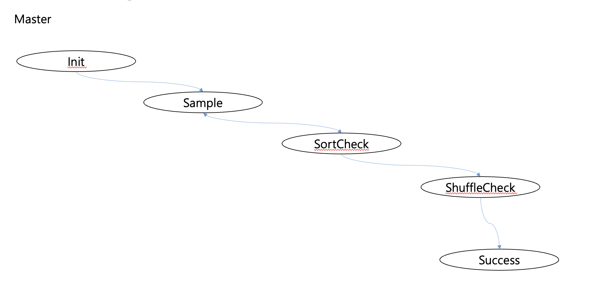
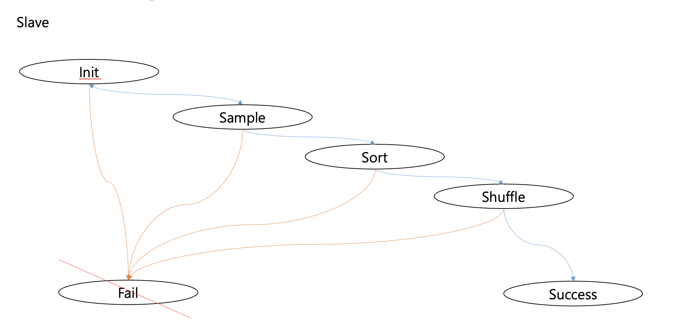
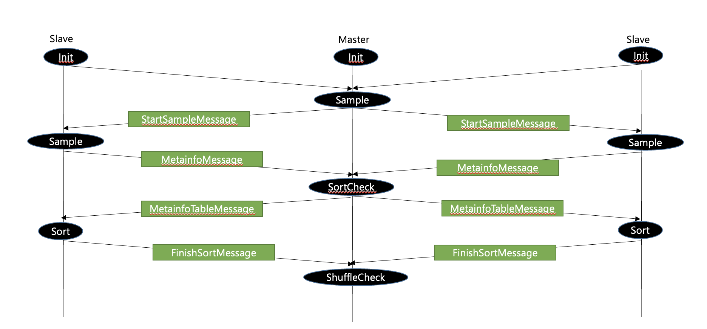
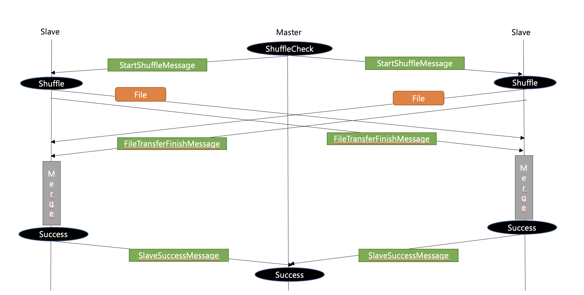
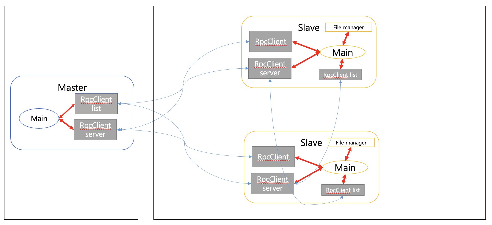

# cs434-project
> This project is a part of Advanced Programming (CSED434) at POSTECH

The objective of this project is implementing __Distributed/Parallel sorting key/value records stored on multiple disks on multiple machines__ using Scala. Basically we assume that mixed key/value data are stored on multiple disks on multiple machine. Therefore, we need a protocol to handle those multiple machine to effectively participate in the sorting process.

## Design

There are two types of node for the protocol

* __Master__: Single node for coordination

* __Slave__: Multiple nodes in which actual data is stored and sorting happens

The protocol can be divided into 4 phases

1. __Sampling__: generate information for distribution of data

2. __Sort/Partition phase__: sorting in parallel at each slave

3. __Shuffle phase__: data exchange via the master node under its coordination

4. __Merge phase__: data from other machines properly merged into a single chunk fit into a single disk

Those two types of machines are basically state machine which make a transition between states as the protocol proceeds

__Master__

* Init

* Sample

* Sortcheck

* ShuffleCheck

* Success

__Slave__

* Init

* Sample

* Sort

* Shuffle

* Success

* ~~Fail~~ (Not implemented)

The protocol also needs a minimum set of variables which makes some side-effects that are tried to be avoided in this project

| **name** | **Location** | **Definition** | **Critical reason (atomic operations are needed**) |
| - | - | - | - |
| connectionCount         | Master       | The number of slaves that make a  TCP connection           | Yes                                                        |
| metainfoCount           | Master       | The number of slaves sent MetainfoMessage                  | Yes                                                        |
| sortedCount             | Master       | The number of slaves sent FinishSortMeesage                | Yes                                                        |
| successCount            | Master       | The number of slaves sent SlaveSuccessMessage              | Yes                                                        |
| metainfoMessageSent     | Slave        | Whether a slave sent MetainfoMessage                       | No                                                         |
| finishSortMessageSent   | Slave        | Whether a slave sent FinishSortMessage                     | No                                                         |
| sortedComplete          | Slave        | Whether data after shuffling is sorted in a disk of  slave | No                                                         |
| slaveId                 | Slave        | Slave’s ID needed to be included in all messages  it send  | No                                                         |
| fileTransferFinishCount | Slave        | The number of peer slaves sent FileTransferFinishMessage   | Yes                                                        |

### State transition rules

__For Master__

Init -> Sample

connectionCount == n

Sample -> SortCheck

metainfoCount == n

SortCheck -> ShuffleCheck

sortedCount == n

ShuffleCheck -> Success

SuccessCount == n

__For Slave__

Init -> Sample

Received(StartSampleMessage) == True

Init -> Fail

Connection fail to Master

Sample -> Sort

Received(MetainfoTableMessage) == True, metainfoMessageSent == True

Sample -> Fail

Fail to get MetainfoTableMessage within a time, Received(MetainfoTableMessage) == True, metainfoMessageSent == False

Sort -> Shuffle

Received(StartShuffleMessage) == True, finishSortMessageSent == True

Sort -> Fail

Received(StartShuffleMessage) == True, finishSortMessageSent == False

Shuffle -> Success

fileTransferFinishCount == n, size(fiileTransferQueue) == 0, sortedComplete == True

Shuffle -> Fail

Received out of bound data

### State diagram

### Flow chart

### Communication model

